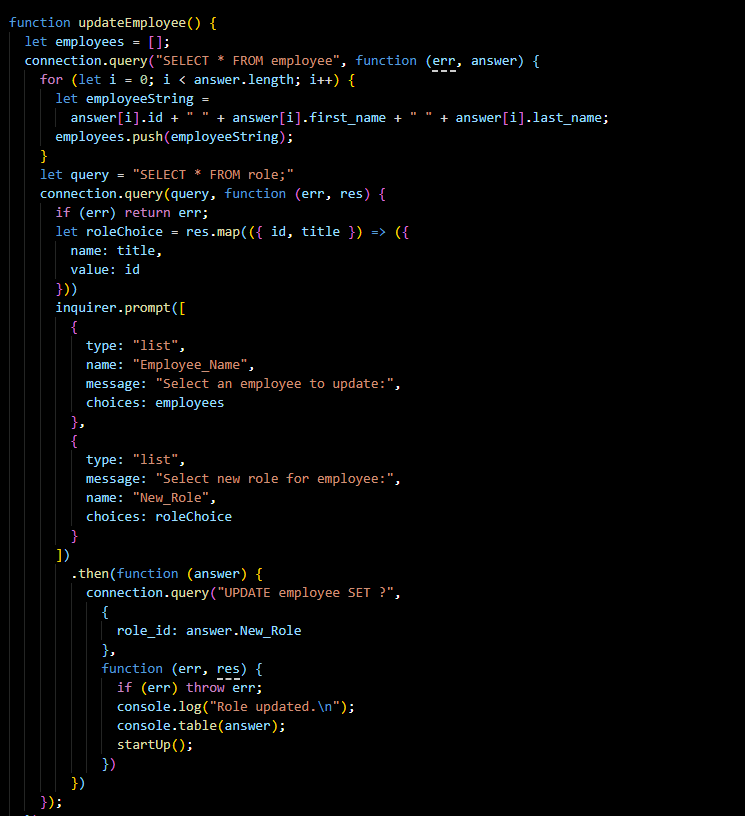
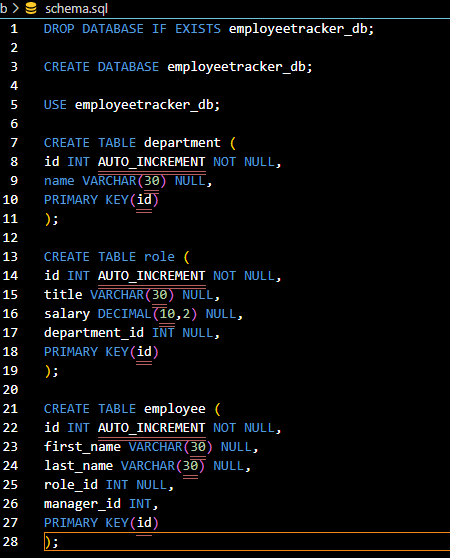

# Employee Management System

  

  ## Table of Contents
  - [Description](#description)
  - [Installation Instructions](#install)
  - [Usage Information](#usage)
  - [Resources](#Resources)
  - [Test](#test)
  - [License](#license)
  - [Questions](#questions)
  
  

  
  ## Description 
  
A user is able to update an existing employee database with new departments, roles, and employees through use of node, inquirer, and mysql; 

The application will connect to MySQL and allow for real time updates to the database and also allow the user to get the information from the database.
  
  

  
 
 
  
  
  ## Installation Instructions 
 
  npm i will install the needed dependencies. MySQL software is also needed. Schema file are included in the db folder.
  
  

  
  ## Usage 
  
  User will install needed dependencies, and MySQL software. User can then run the application via node app.js. User can enter new depts, roles, and employees with in the cli. User can also update an existing employee with a new role.
  
  [Watch application in action here.](https://drive.google.com/file/d/1MJ6JOqCWNRGPgUfWfe-CkVlFFSU7eaN7/view?usp=sharing)

  User will also have to update the app.js with their connection information:

  <ul>
    <li>Port</li>
    <li>Username</li>
    <li>Password</li>
  </ul>
  
  

  
  ## Resources 
  
  MySQL, Node, Inquirer, Console.Table
  
  

  
  ## Test Information 
  
  None Available
  
  

  
  ## License 
  
  Please refer to the following license for guidelines, usage details, and information.
  
  License: MIT
  
  

  
  ## Questions 
  
  For any questions regarding this material, contact me at the following:
  
  Email: jaimeharman17@gmail.com
